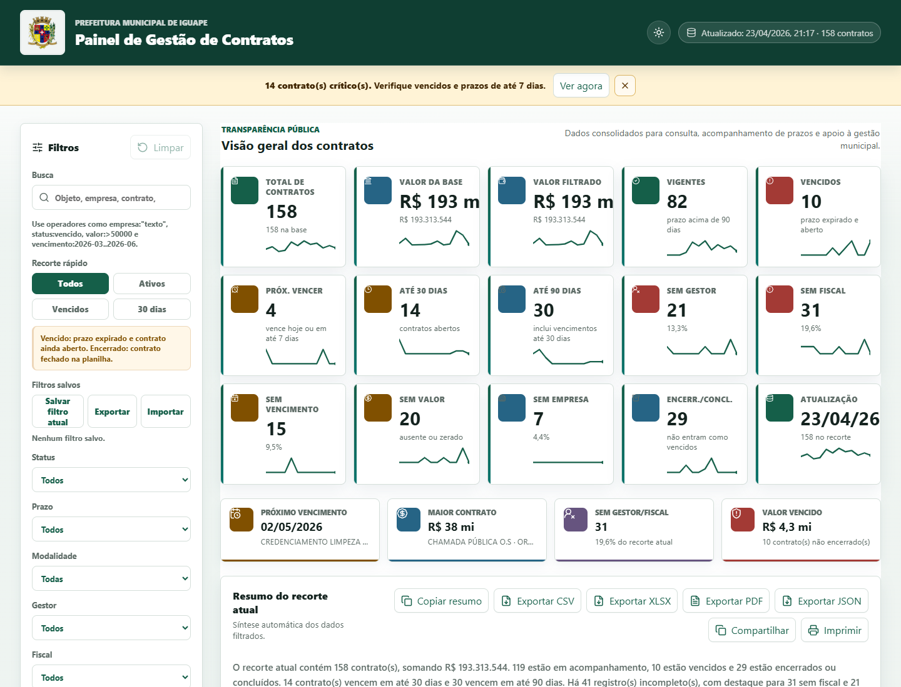
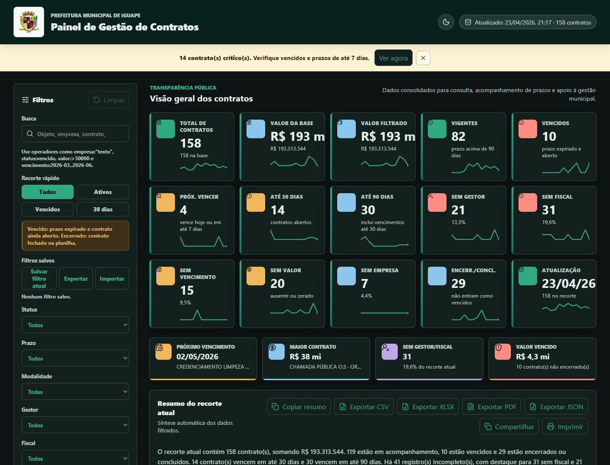
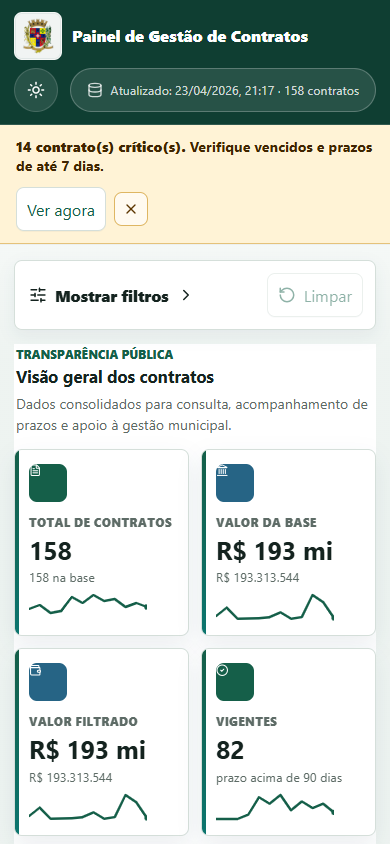
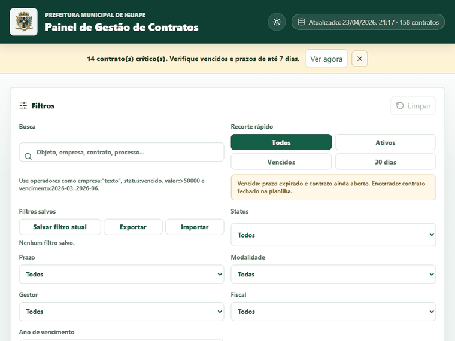
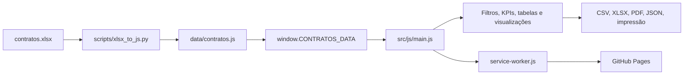

# Painel de Contratos — Iguape/SP

[](https://github.com/matheuhenriqu/painel-contratos-iguape-sp/actions/workflows/ci.yml)
[](https://github.com/matheuhenriqu/painel-contratos-iguape-sp/actions/workflows/pages.yml)
[](https://github.com/matheuhenriqu/painel-contratos-iguape-sp/actions/workflows/lighthouse.yml)
[](LICENSE)
[](https://github.com/matheuhenriqu/painel-contratos-iguape-sp/commits/main)

Painel público, estático e instalável para transparência, consulta e gestão dos contratos da Prefeitura Municipal de Iguape/SP. A aplicação roda direto no GitHub Pages, sem backend, sem CDN e sem etapa obrigatória de build para produção.

**Produção:** <https://matheuhenriqu.github.io/painel-contratos-iguape-sp/>



## Sumário

- [Demonstração](#demonstração)
- [Quick start](#quick-start)
- [Funcionalidades](#funcionalidades)
- [Stack](#stack)
- [Arquitetura e documentação](#arquitetura-e-documentação)
- [Como atualizar dados](#como-atualizar-dados)
- [Qualidade](#qualidade)
- [Roadmap](#roadmap)
- [Changelog](#changelog)
- [Governança](#governança)

## Demonstração

| Tema escuro                                                | Mobile                                                           |
| ---------------------------------------------------------- | ---------------------------------------------------------------- |
|  |  |



## Quick start

Para usar o painel, acesse a página publicada, filtre os contratos e compartilhe a URL gerada. A busca, filtros, ordenação, recortes rápidos e detalhe de contrato ficam preservados por query string e hash.

Para desenvolvimento local:

```bash
npm install
npm run serve
```

Abra `http://127.0.0.1:4173/`. O projeto também pode ser servido por qualquer servidor estático apontando para a raiz do repositório.

## Funcionalidades

- Consulta por busca textual, busca avançada com operadores e filtros por status, prazo, modalidade, gestor, fiscal e ano.
- KPIs clicáveis, alertas de urgência, favoritos de filtros e URLs compartilháveis.
- Detalhe de contrato em `<dialog>` com cópia, impressão individual e compartilhamento.
- Visualização em tabela ou cards no mobile, com alvos de toque amplos e navegação por teclado.
- Gráficos Chart.js com lazy-load, timeline, heatmap, treemap, sparklines e comparativo gestor/fiscal em SVG.
- Exportações CSV, XLSX, PDF e JSON executadas 100% no navegador.
- PWA instalável, service worker offline-first, SEO, Open Graph, sitemap, robots e JSON-LD.
- Impressão institucional com filtros aplicados, URL canônica e QR code gerado localmente.

## Stack



## Arquitetura e documentação

- [Auditoria inicial](docs/AUDIT.md)
- [Baseline técnico e Lighthouse](docs/BASELINE.md)
- [Design system](docs/design-system.md)
- [SEO e PWA](docs/seo-pwa.md)
- [Atalhos de teclado](docs/atalhos.md)
- [Guia de uso](docs/uso.md)
- [Visualizações analíticas](docs/visualizacoes.md)
- [Diretrizes de acessibilidade](docs/a11y/diretrizes.md)
- [Qualidade automatizada](docs/qualidade.md)
- [ADRs](docs/adr/README.md)

## Como atualizar dados

O arquivo `data/contratos.js` é a fonte da verdade consumida pela aplicação e deve preservar o formato `window.CONTRATOS_DATA = { source, sheet, generatedAt, recordCount, records: [...] }`.

Fluxo recomendado:

```bash
python -m pip install -r scripts/requirements.txt
python scripts/xlsx_to_js.py contratos.xlsx --sheet CONTRATOS --output data/contratos.js
npm run validate:data
npm run lint
npm test
```

O pipeline Python normaliza strings, datas e valores, valida o JSON Schema em `scripts/schema/contratos.schema.json`, ordena os registros por `id` e grava o arquivo estático. Antes de publicar, confira `recordCount`, abra o painel, revise eventuais avisos de dados e teste exportações.

## Qualidade

```bash
npm run lint
npm test
npm run test:e2e
npm run validate:data
npm run axe:audit
npm run lhci
```

O CI executa lint, testes unitários, Playwright, validação de dados, axe-core, Lighthouse CI e deploy para GitHub Pages quando `main` fica verde.

## Roadmap

- Etapa 0: diagnóstico, baseline e fundação do repositório.
- Etapa 1: modularização ES Modules nativos.
- Etapa 2: design system com temas claro, escuro, alto contraste e automático.
- Etapa 3: PWA, SEO e metadados estruturados.
- Etapa 4: performance, sprite SVG, lazy-load, virtualização e worker.
- Etapa 5: UX avançada com drawer, cards, atalhos, favoritos e busca avançada.
- Etapa 6: visualizações analíticas profundas.
- Etapa 7: acessibilidade reforçada e impressão institucional.
- Etapa 8: exportações XLSX, PDF, JSON, compartilhamento e pipeline Python.
- Etapa 9: qualidade automatizada, testes e CI/CD.
- Etapa 10: polimento final, documentação de vitrine e release v2.0.0.

## Changelog

Veja o histórico completo em [CHANGELOG.md](CHANGELOG.md).

## Governança

- [Como contribuir](CONTRIBUTING.md)
- [Código de Conduta](CODE_OF_CONDUCT.md)
- [Segurança](SECURITY.md)
- Licença: [MIT](LICENSE)
