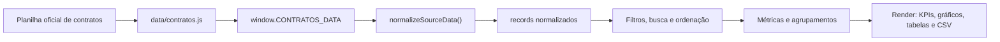

# Auditoria inicial

Etapa 0/10: diagnóstico leve do estado atual do painel antes das etapas de evolução.

## Resumo

- O site é estático, publicado a partir da raiz, sem backend e sem etapa obrigatória de build.
- Na auditoria inicial, `index.html` carregava `assets/vendor/chart.umd.min.js`, `assets/vendor/lucide.min.js`, `data/contratos.js` e `app.js` com `defer`.
- A CSP atual permanece restritiva e não foi alterada nesta etapa.
- `data/contratos.js` expõe `window.CONTRATOS_DATA` com `recordCount` igual a `158`.
- Na auditoria inicial, `app.js` era um script único, não modularizado, com 139 funções declaradas no escopo global/script.
- `styles.css` concentra o design system atual, estados responsivos e classes dinâmicas geradas pelo JavaScript.
- Na Etapa 1, o script monolítico foi removido e substituído por ES Modules nativos em `src/js/`, sem alterar a UX visível.

## Fluxo de dados



## Antes/depois da árvore JavaScript

### Antes da Etapa 1

```text
.
├── app.js
├── data/
│   └── contratos.js
└── assets/
    └── vendor/
        ├── chart.umd.min.js
        └── lucide.min.js
```

### Depois da Etapa 1

```text
.
├── data/
│   └── contratos.js
├── assets/
│   └── vendor/
│       ├── chart.module.js
│       ├── chart.umd.min.js
│       └── lucide.min.js
└── src/
    └── js/
        ├── constants.js
        ├── main.js
        ├── data/
        │   ├── aggregate.js
        │   ├── classify.js
        │   ├── normalize.js
        │   └── source.js
        ├── state/
        │   ├── store.js
        │   └── url-sync.js
        ├── ui/
        │   ├── back-to-top.js
        │   ├── charts.js
        │   ├── export-csv.js
        │   ├── feedback.js
        │   ├── filters.js
        │   ├── kpis.js
        │   ├── print.js
        │   ├── quality.js
        │   ├── section-toggles.js
        │   ├── summary.js
        │   └── table.js
        └── utils/
            ├── dates.js
            ├── dom.js
            ├── format.js
            └── strings.js
```

O `index.html` agora carrega `src/js/main.js` com `type="module"`. O Chart.js continua vendorizado localmente e passa a ser carregado sob demanda por `assets/vendor/chart.module.js`, mantendo a política `script-src 'self'`.

## Funções globais por responsabilidade

### Data

- `buildDashboardMetrics`
- `getDataQualityMetrics`
- `hasIncompleteRegistration`
- `getQualityAlerts`
- `normalizeSourceData`
- `buildDisplayFields`
- `classifyContract`
- `buildSearchIndex`
- `calculateDaysUntil`
- `formatContractValue`
- `hasMissingContractValue`
- `sum`
- `countBy`
- `sumBy`

### UI

- `init`
- `hydrateFilters`
- `bindEvents`
- `render`
- `updateViewState`
- `renderKpis`
- `renderInsights`
- `renderQuality`
- `renderAutoSummary`
- `renderResultSummary`
- `updateActionControls`
- `showActionFeedback`
- `applyDensityMode`
- `queueRender`
- `toggleSection`
- `scheduleBackToTopUpdate`
- `updateBackToTopButton`

### Charts

- `renderCharts`
- `getDueMonthData`
- `getDeadlineDistribution`
- `renderChart`
- `shortLabel`
- `chartColors`
- `upsertChart`
- `getChartSignature`
- `commonPlugins`
- `doughnutOptions`
- `horizontalBarOptions`
- `verticalBarOptions`
- `chartAnimation`

### Filters

- `getFilteredRows`
- `renderActiveFilters`
- `updateFilterControls`
- `getActiveFilterCount`
- `hasActiveAdjustments`
- `applyQuickFilter`
- `renderQuickFilterIndicators`
- `getCurrentQuickFilter`
- `matchesPrazoFilter`
- `configureFilterPanel`
- `setFiltersCollapsed`
- `restoreStateFromUrl`
- `syncFilterInputs`
- `getAllowedSelectValue`
- `getAllowedSortKey`
- `getAllowedSortDir`
- `getUrlDensityValue`
- `updateUrlFromState`
- `setFilterParam`
- `clearSingleFilter`
- `getSearchTerms`
- `matchesSearchTerms`
- `updateSearchClearButton`

### Table

- `renderTable`
- `renderSectionTable`
- `renderRows`
- `renderStatusCell`
- `rowClassNames`
- `fieldCellClass`
- `getRowSummary`
- `sortRows`
- `compareRowsBySort`
- `getSortValue`
- `compareNullableValues`
- `isMissingSortValue`
- `sortByDueDateAsc`
- `compareDueDateAsc`
- `renderSortIndicators`
- `isCurrentContract`
- `isExpiredContract`
- `isCompletedContract`
- `syncSortControls`
- `renderEmptyRow`
- `formatTableCount`
- `renderTablePager`
- `resetVisibleLimit`
- `getPageSize`
- `formatContractTiming`
- `deadlineRowClass`
- `timingClass`
- `statusClass`

### Export

- `buildTextSummary`
- `formatActiveFiltersForSummary`
- `copyCurrentSummary`
- `exportFilteredCsv`
- `getRowsForExport`
- `buildCsv`
- `getCsvField`
- `csvValue`
- `downloadTextFile`
- `writeClipboard`
- `formatFileDate`

### Utils

- `getFieldText`
- `isBlank`
- `queryRequired`
- `queryAll`
- `addMediaChangeListener`
- `fillSelect`
- `createOption`
- `setSafeHtml`
- `clearElement`
- `unique`
- `normalizeText`
- `compactSearchText`
- `parseDate`
- `startOfDay`
- `formatDate`
- `formatUpdatedAt`
- `formatShortUpdatedAt`
- `formatDays`
- `formatDayCount`
- `slugifyClassName`
- `compactCurrency`
- `formatCurrency`
- `toFiniteNumber`
- `getPercent`
- `formatPercent`
- `capitalizeFirst`
- `isSmallViewport`
- `isFilterViewport`
- `isReducedMotion`
- `escapeHtml`
- `escapeAttr`

## Classes CSS por componente

### Acessibilidade e base

- `sr-only`
- `skip-link`

### Layout, cabeçalho e rodapé

- `app-shell`
- `workspace`
- `topbar`
- `topbar-actions`
- `brand`
- `brand-copy`
- `brand-logo`
- `brand-logo-frame`
- `updated-label`
- `section-heading`
- `compact`
- `panel`
- `panel-header`
- `contract-groups`
- `grouped-table-panel`
- `site-footer`

### Botões, controles e estados

- `ghost-button`
- `quick-filter-button`
- `mini-action-button`
- `input-clear-button`
- `sort-dir-button`
- `pager-button`
- `density-button`
- `section-toggle-button`
- `floating-top-button`
- `is-active`
- `is-desc`
- `is-sorted`
- `is-collapsed`
- `is-section-collapsed`
- `is-compact`
- `danger`

### Filtros e busca

- `filters`
- `filter-header`
- `filter-title-button`
- `filter-count-badge`
- `filter-chevron`
- `filter-body`
- `field`
- `input-shell`
- `quick-filter-group`
- `status-note`
- `filter-chip`
- `active-filters`

### Indicadores, insights e resumo

- `kpi-grid`
- `kpi-card`
- `kpi-icon`
- `insight-grid`
- `insight-card`
- `insight-icon`
- `summary-panel`
- `summary-header`
- `auto-summary`
- `action-toolbar`
- `action-feedback`
- `result-summary`

### Qualidade cadastral

- `quality-panel`
- `quality-grid`
- `quality-card`
- `quality-icon`
- `quality-alerts`
- `quality-alert`
- `ok`
- `neutral`

### Gráficos

- `analytics-grid`
- `chart-frame`
- `chart-empty`

### Tabelas

- `table-panel`
- `table-toolbar`
- `table-title`
- `table-controls`
- `sort-control`
- `table-scroll`
- `table-pager`
- `contracts-table-body`
- `empty-state`
- `object-cell`
- `money-cell`
- `date-cell`
- `missing-field`
- `muted`
- `reference-code`
- `status-cell`
- `status-badge`
- `timing-pill`
- `row-expired`
- `row-due-soon`
- `row-due-today`
- `row-due-mid`
- `row-current`
- `row-no-date`
- `row-insufficient`
- `row-closed`
- `row-missing-gestor`
- `row-missing-fiscal`

### Status, prazos e paleta

- `status-vigente`
- `status-vence-hoje`
- `status-proximo-de-vencer`
- `status-vence-ate-30`
- `status-vence-31-90`
- `status-vencido`
- `status-encerrado`
- `status-concluido`
- `status-sem-data`
- `status-sem-informacao`
- `timing-ok`
- `timing-warning`
- `timing-notice`
- `timing-danger`
- `timing-closed`
- `timing-neutral`
- `green`
- `teal`
- `amber`
- `red`
- `plum`
- `blue`

### Utilitárias e suporte dinâmico

- `clipboard-buffer`
- `metric-row`

## Achados estáticos

### IDs órfãos ou sem referência direta

IDs presentes no HTML sem referência direta detectada em seletores JS, `renderChart()` ou atributos ARIA/href:

- `completedContractsSection`
- `expiredContractsSection`
- `summaryHint`

Observação: `completedContractsSection` e `expiredContractsSection` também possuem `data-collapsible-section`; a lógica atual usa `closest("[data-collapsible-section]")`, então os IDs parecem sobras ou âncoras futuras.

### IDs referenciados que não existem no HTML

- Nenhum ID obrigatório referenciado por seletores do app ficou sem elemento correspondente.

### Classes no HTML sem regra CSS direta

- `chart-panel`
- `quick-filter-field`
- `section-content`

Essas classes podem ser ganchos futuros ou nomes sem uso direto. A UX atual depende principalmente de classes combinadas como `panel`, `field` e `table-scroll`.

### Classes CSS sem uso literal em HTML/JS

- `metric-row`
- `mini-action-button`
- `status-concluido`
- `status-encerrado`
- `status-proximo-de-vencer`
- `status-sem-data`
- `status-sem-informacao`
- `status-vence-31-90`
- `status-vence-ate-30`
- `status-vence-hoje`
- `status-vencido`
- `status-vigente`
- `timing-closed`
- `timing-danger`
- `timing-neutral`
- `timing-notice`
- `timing-ok`
- `timing-warning`

Observação: as classes `status-*` e `timing-*` são suporte dinâmico para `statusClass()` e `timingClass()`. As candidatas reais a revisão futura são `metric-row` e `mini-action-button`.

### Variáveis não usadas

- Nenhuma constante ou variável de topo apareceu com apenas uma ocorrência na verificação textual.

### Funções com possível código morto

- `formatContractTiming`
- `deadlineRowClass`

Essas funções apareceram apenas na declaração durante a auditoria textual. Confirmar em testes antes de remover, pois a etapa 0 não altera comportamento.

### Listeners duplicados

- Foram contadas 21 chamadas a `addEventListener`/`addListener`.
- A análise textual agrupou três ocorrências como `button + click`, mas elas pertencem a listas diferentes (`quickFilterButtons`, `sectionToggleButtons` e botões de ordenação por coluna).
- Não foi detectado listener duplicado no mesmo elemento nomeado.

## Observações atualizadas para as próximas etapas

- A modularização em ES Modules foi concluída na Etapa 1 com separação entre dados, filtros/URL, renderização de tabela, gráficos, exportação e utilitários.
- Antes de remover classes/funções candidatas a código morto, criar testes de regressão para filtros, tabelas, gráficos e CSV.
- Manter compatibilidade dos query params atuais: `busca`, `status`, `modalidade`, `gestor`, `fiscal`, `prazo`, `ano`, `ordem`, `direcao` e `compacto`.
